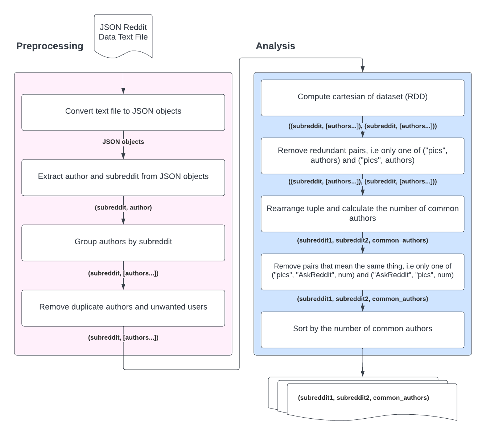

# Common Subreddit Authors Analysis

This projects aims to find out what subreddits have the most authors of comments in common, utilizing the extensive records of reddit comment data at [Pushshift](https://files.pushshift.io/reddit/comments/).

## Layout

The `conf/` directory contains boilerplate configuration for setting up a cluster of nodes on multiple machines, in the cloud for example.
The `src/` directory contains a test notebook for evaluating whether the cluster is working correctly or not, and the actual experiment/analysis.

## Analysis Flow
This is a flowchart depcting the steps involved in both preprocessing and analysing the reddit comment data before the desired result is produced.

## Running the Analysis

To run the analysis, a Spark cluster and HDFS environment needs to be configured and deployed. Using a distributed cluster of workers, the analysis is able to scale well with larger datasets and more processing nodes. Here are some of the initial steps for making sure a correct and working setup:

1. Ensure that the CSV files are stored in a location that is accessible by Spark.

2. Configure and setup machines/cloud instances using the instructions provided in [use_cluster_instructions.md](use_cluster_instructions.md).

3. Modify the provided notebooks in `src/` to specify the connection details of your Spark cluster and the precise location of the HDFS file.

Once the configuration of the cluster and environment is up and running, the next step is to run the analysis by execurting cells in the providing notebooks from top to bottom, in order.

## Authors

Anirudh A Inginshetty, Joel Sikström, Max Norberg, Nils Carlberg

Please see `report.pdf` for a detailed report of this project.
